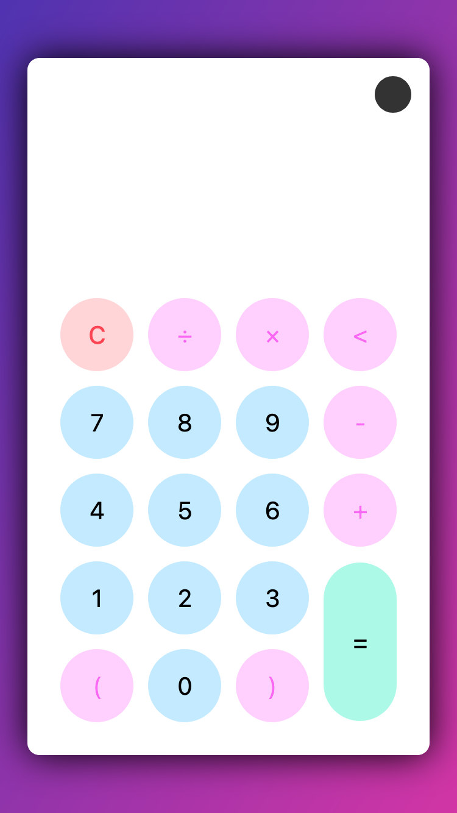
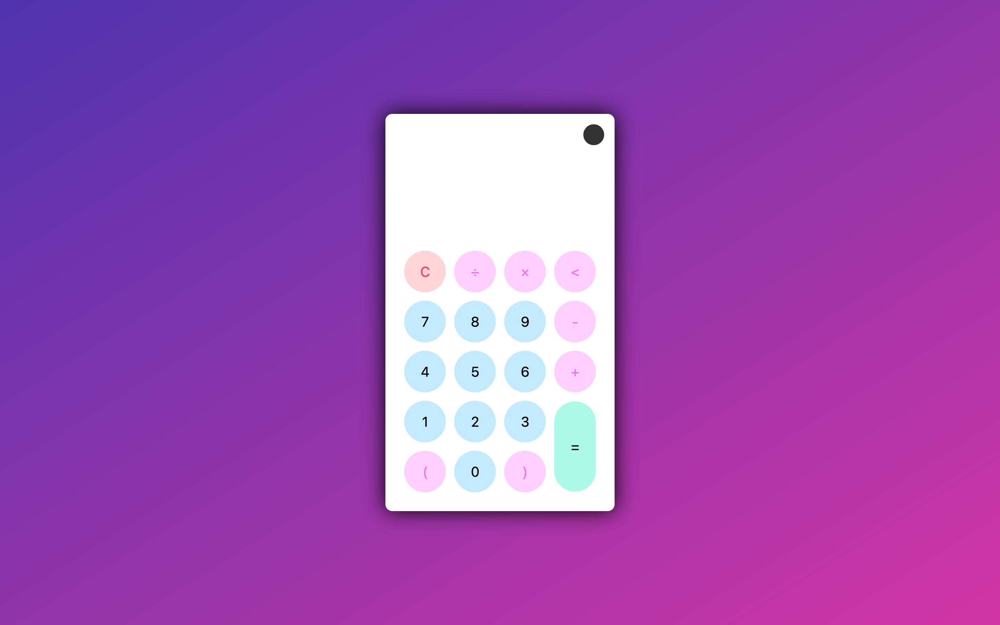

# Light/Dark Mode Calculator
## Overview
Responsive calculator with toggle to switch between light and dark modes.

### Screenshot
* 375px: [Mobile - Light Mode](screenshots/light-375px.png)
* 375px: [Mobile - Dark Mode](screenshots/light-375px.png)

* 1440px: [Desktop - Light Mode](screenshots/light-1440px.png)
* 1440px: [Desktop - Dark Mode](screenshots/dark-1440px.png)

### Credit
This calculator was built following a [Not Only Dev](https://www.youtube.com/watch?v=_npnL4Gyg_o) on YouTube.

## My Process

### Built With
* HTML5
* CSS3
* Vanilla JavaScript

